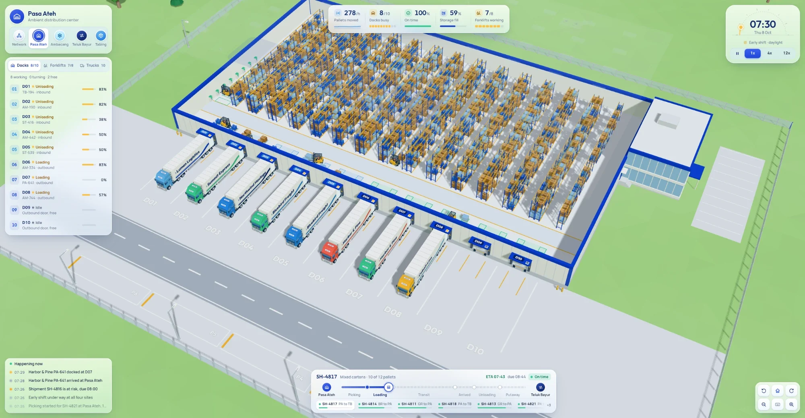
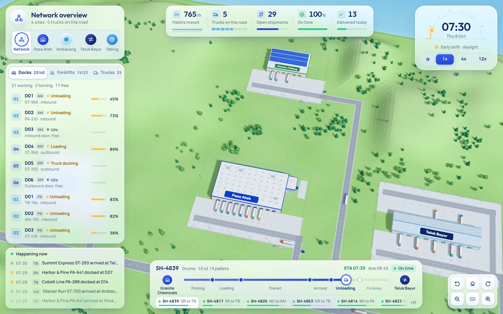
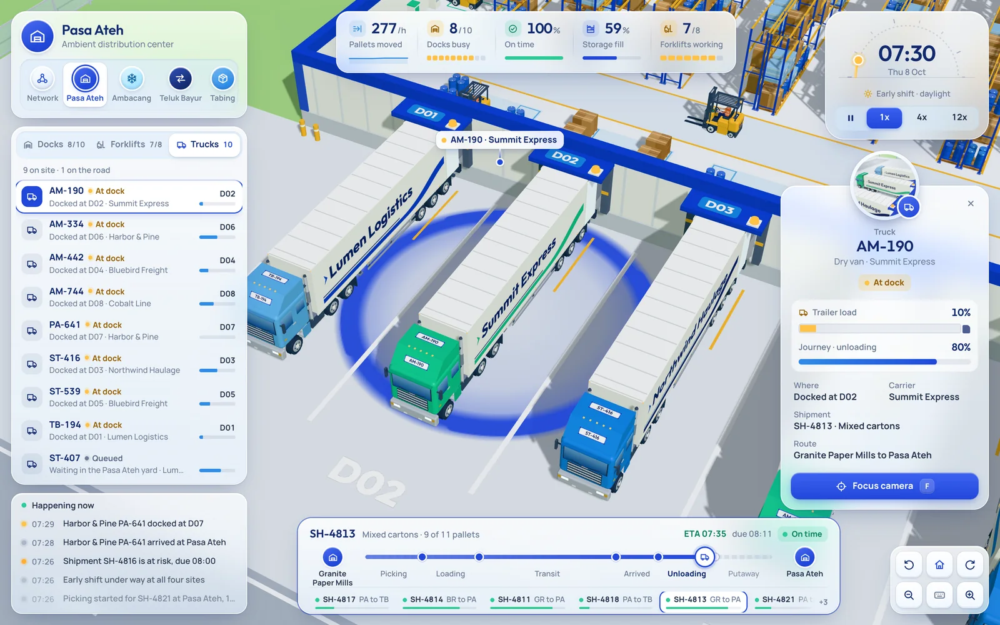
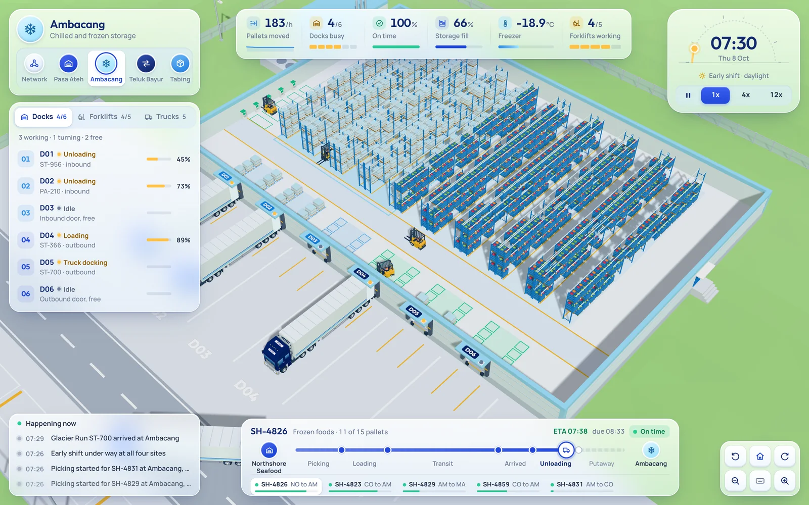
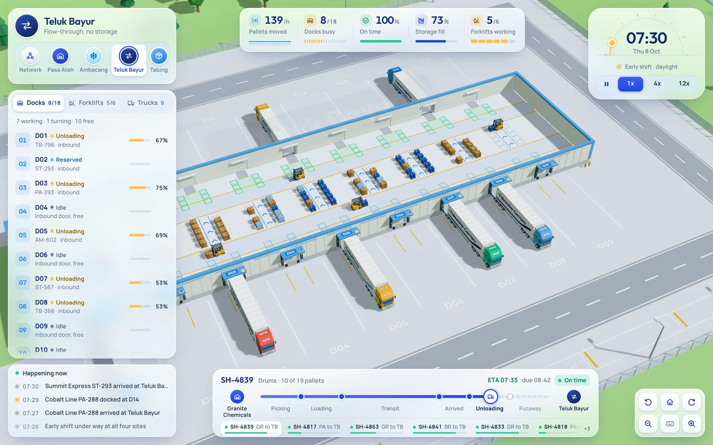

<div align="center">

# Bongkar

**A warehouse operations console that plays like a city-builder.**

Command a living toy diorama of four warehouses: trucks roll in off the highway, reverse into
the docks and unload, forklifts thread the aisles, and shipments flow between sites while you
watch from above.


<br />



<sub><i>Pasa Ateh at 07:30. The roof has lifted so you can see inside; eight of ten docks are working.</i></sub>

</div>

<br />

## Why it exists

Warehouse dashboards are usually tables of numbers. Bongkar (Indonesian for "unload") asks a
different question: what if running a yard felt like playing a calm strategy game? Every truck,
forklift and pallet on screen is a real agent in a running simulation, and every number in the
HUD comes from what you can see happening in the world.

## Highlights

| | |
|---|---|
| **Lift the lid** | Zoom toward a warehouse and its roof floats away like the lid of a toy box, revealing racks filling up and forklifts at work. Zoom out and it settles back. |
| **A living yard** | Trucks drive the highway, queue at the gate, reverse into docks, swing their doors open and leave for the next site. Forklifts reverse out of trailers, lift pallets to the top rack and head to the charger when their battery runs low. |
| **Select anything** | Click a truck, forklift, pallet, dock or building. A ring marks it, a route line shows where it is headed, and a live 3D portrait appears on its card. |
| **Strategy-game HUD** | Site switcher, a sun-dial clock with speed control, live KPIs, a roster of docks, forklifts and trucks, a shipment progress track and an event feed, all on floating glass panels. |
| **All made in code** | No model files and no image textures. Every building, truck, forklift and pallet is built from three.js geometry. |

## Gallery

<table>
  <tr>
    <td width="50%"></td>
    <td width="50%"></td>
  </tr>
  <tr>
    <td align="center"><sub><b>Network view</b>: four sites on one island, joined by the highway</sub></td>
    <td align="center"><sub><b>Selection</b>: truck AM-190 docked at D02, with its card and live portrait</sub></td>
  </tr>
  <tr>
    <td width="50%"></td>
    <td width="50%"></td>
  </tr>
  <tr>
    <td align="center"><sub><b>Ambacang</b>: frozen and chilled zones, freezer at -18.9 °C</sub></td>
    <td align="center"><sub><b>Teluk Bayur</b>: cross-dock, pallets flow straight from one side to the other</sub></td>
  </tr>
</table>

## The sites

| Site | Code | Kind | What happens there |
|---|---|---|---|
| **Pasa Ateh** | PA | Distribution center | 10 docks, 14 rack aisles, 8 forklifts |
| **Ambacang** | AM | Cold chain | Frozen and chilled rack zones, rooftop condensers |
| **Teluk Bayur** | TB | Cross-dock | Doors on both long sides, short dwell on floor lanes, no storage |
| **Stasiun Tabing** | ST | Parcel hub | Sawtooth roof with solar panels, parcel loads |

Truck plates carry the code of their home site (for example `PA-210`), forklifts are `FL-01`
and up at each site, pallets are `P-` numbers and shipments are `SH-` numbers.

## Quick start

You need Node 20.19+ or 22.12+.

```bash
npm install
npm run dev
```

Open http://localhost:5173 and you land at Pasa Ateh at the start of the early shift.

| Command | What it does |
|---|---|
| `npm run dev` | Start the dev server with hot reload |
| `npm run build` | Typecheck and build for production into `dist/` |
| `npm run preview` | Serve the production build |
| `npm run typecheck` | Typecheck only |

## Controls

| Input | Action |
|---|---|
| Drag | Pan the map |
| Right-drag or Shift-drag | Rotate and tilt |
| Scroll | Zoom toward the cursor (zoom into a site to lift its roof) |
| `W` `A` `S` `D` / arrows | Pan |
| `Q` / `E` | Rotate |
| Click | Select a truck, forklift, pallet, dock or site |
| Double-click or `F` | Fly to the selection and follow it |
| `[` / `]` | Previous / next site |
| `H` | Home view for the current site |
| `Space` | Pause |
| `1` / `2` / `3` | Speed 1x / 4x / 12x |
| `Esc` | Clear the selection |

## How it works

```
src/
  core/      palette, constants, site definitions, the computed layout
             (doors, rack slots, forklift paths, highways) and module contracts
  world/     sky, island, river, roads and the four site buildings
  vehicles/  trucks, forklifts and one instanced renderer for every pallet
  sim/       clock, trucks, forklifts, pallets, shipments, KPIs, HUD data
  hud/       the game HUD in plain TypeScript, DOM and CSS
  scene/     camera, selection ring, route lines, live portrait
  main.ts    wiring and the frame loop
```

- **One shared layout.** `src/core/layout.ts` computes every door, rack slot, forklift path
  and highway from the site definitions. The world draws from it, the simulation drives on it,
  so a truck parked by the simulation always lines up with the door the world drew.
- **Contracts between modules.** `src/core/contracts.ts` defines what each module provides,
  so the world, vehicles, simulation and HUD were built in parallel and dropped in cleanly.
- **Built for 60 fps.** Static scenery is merged into a few meshes, racks and trees are
  instanced, every pallet in the world shares one instanced renderer, and vehicles share one
  compiled shader. A full site view renders in about 150 draw calls.
- **A simulation, not an animation.** Trucks reserve road zones and keep their distance;
  forklifts reserve aisles so they never collide or deadlock. The world starts with a few
  minutes already simulated, so the first frame is mid-shift.

## Design

The look is a bright, calm daylight diorama: white and sky-blue buildings with cobalt trim,
soft shadows, and glass HUD panels with cobalt-tinted shadows.


Type is **Outfit** for display and **Manrope** for the interface, both bundled locally.
The full plan, including the layout sketch and a review against generic dashboard defaults,
is in [DESIGN.md](DESIGN.md). Progress is tracked in [TASKS.md](TASKS.md).
